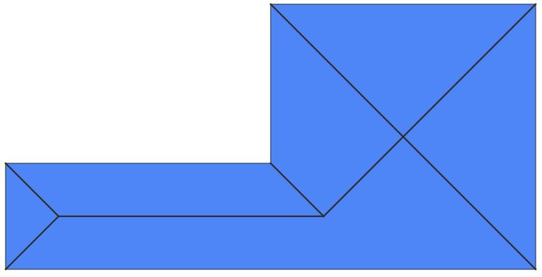
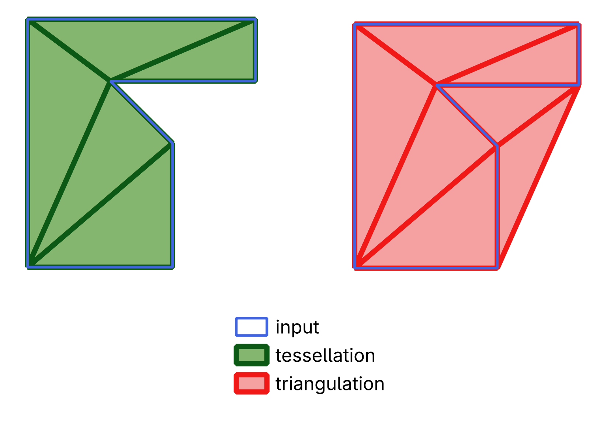

# Cookbook

## Geometry creation

### Create a Point

{{ include_python_file("../cookbook/point.py") }}

### Create a Linestring

{{ include_python_file("../cookbook/linestring.py") }}

### Create a Polygon

{{ include_python_file("../cookbook/polygon.py") }}

### Create a MultiPoint

{{ include_python_file("../cookbook/multipoint.py") }}

### Create a MultiLineString

{{ include_python_file("../cookbook/multilinestring.py") }}

### Create a MultiPolygon

{{ include_python_file("../cookbook/multipolygon.py") }}

### Create a GeometryCollection

{{ include_python_file("../cookbook/geometry_collection.py") }}

### Create a Geometry from [WKT](https://en.wikipedia.org/wiki/Well-known_text_representation_of_geometry)

{{ include_python_file("../cookbook/geom_from_wkt.py") }}

## Algorithms

### Calculate a [Straight Skeleton](https://en.wikipedia.org/wiki/Straight_skeleton)

{{ include_python_file("../cookbook/straight_skeleton.py") }}

{: width=500 }

### Triangulate or Tessellate

{{ include_python_file("../cookbook/triangulation.py") }}

{: width=500 }

## Integration with other libraries

### Export a Geometry to GeoPackage with GDAL

{{ include_python_file("../cookbook/export_gpkg.py") }}
