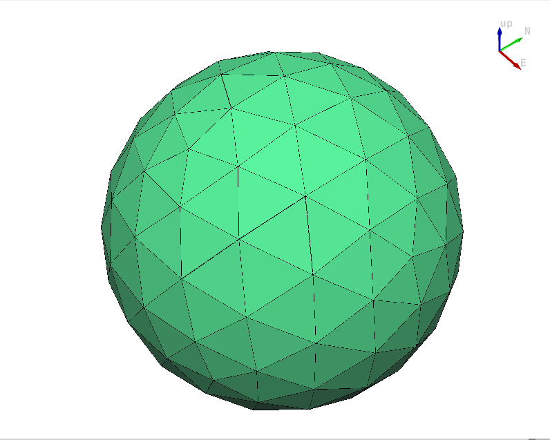

# Cookbook

## Geometry creation

### Use geometry class constructors

#### Create a Point

{{ include_python_file("cookbook/point.py") }}

#### Create a Linestring

{{ include_python_file("cookbook/linestring.py") }}

#### Create a Polygon

{{ include_python_file("cookbook/polygon.py") }}

#### Create a MultiPoint

{{ include_python_file("cookbook/multipoint.py") }}

#### Create a MultiLineString

{{ include_python_file("cookbook/multilinestring.py") }}

#### Create a MultiPolygon

{{ include_python_file("cookbook/multipolygon.py") }}

#### Create a GeometryCollection

{{ include_python_file("cookbook/geometry_collection.py") }}

#### Create a Triangle

{{ include_python_file("cookbook/triangle.py") }}

#### Create a TriangulatedSurface

{{ include_python_file("cookbook/triangulatedsurface.py") }}

#### Create a PolyhedralSurface

{{ include_python_file("cookbook/polyhedralsurface.py") }}

#### Create a Solid

{{ include_python_file("cookbook/solid.py") }}

#### Create a MultiSolid

{{ include_python_file("cookbook/multisolid.py") }}

### Create geometries from external formats

#### Create a Geometry from [WKT/WKB](https://en.wikipedia.org/wiki/Well-known_text_representation_of_geometry)

{{ include_python_file("cookbook/geom_from_wkt.py") }}

{{ include_python_file("cookbook/geom_from_wkb.py") }}

#### Create a Geometry from [GeoJSON](https://en.wikipedia.org/wiki/GeoJSON)

See the [GeoJSON format RFC](https://www.rfc-editor.org/info/rfc7946/) for more details about the GeoJSON format.

{{ include_python_file("cookbook/geom_from_geojson.py") }}

#### Create a Geometry from [OBJ](https://en.wikipedia.org/wiki/Wavefront_.obj_file)

{{ include_python_file("cookbook/geom_from_obj.py") }}

## Primitive

{{ include_python_file("cookbook/primitive.py") }}

{: width=500 }

## Algorithms

### Area

{{ include_python_file("cookbook/area.py") }}

### Calculate a [Straight Skeleton](https://en.wikipedia.org/wiki/Straight_skeleton)

{{ include_python_file("cookbook/straight_skeleton.py") }}

{: width=500 }

### Triangulate or Tessellate

{{ include_python_file("cookbook/triangulation.py") }}

{: width=500 }

## Integration with other libraries

### Export a Geometry to GeoPackage with GDAL

{{ include_python_file("cookbook/export_gpkg.py") }}
